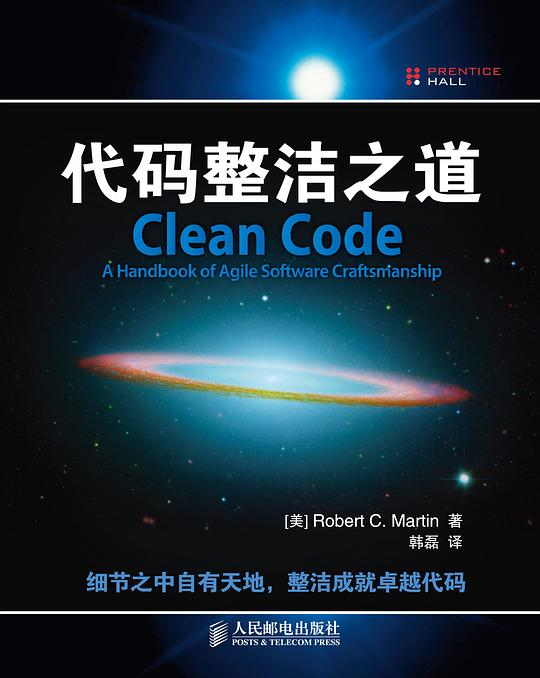

# 代码整洁之道 (javascript 版本)

## 目录

1. 简介
2. 变量
3. 函数
4. 对象和数据结构
5. 类
6. SOLID 和设计模式
7. 测试
8. 并发
9. 错误处理
10. 格式化
11. 注释

## 简介



相信大家对这本 Robert C. Martin 的《代码整洁之道》应该都耳熟能详，但书中所使用的编程语言是 java。本项目所有内容来自于该书，同时用 JavaScript 语言重新进行描述。这不是一个编码风格指南，而是用于指导大家在用 JavaScript 开发时，如何编写有可读性、可复用性和可重构代码的指南。

本文涉及到的所有编码原则都是属于指导性质，并不严格要求大家遵守，但至少能够得到大多数人的认同，毕竟都是行业前辈们多年开发经验汇集而成的。

我们的软件工程技术只有 50 多年的历史，并且仍然保持着高速的发展，这些积累导致我们需要学习很多东西。当软件架构和架构本身一样古老时，也许我们会更难遵循规则。现在，让这些准则作为一个试金石，用来评估您和您团队编写的 JavaScript 代码的质量。

还有一件事情：了解这些编码原则并不会让人成为一个优秀的软件工程师，实际上，即使抱着这些原则从事开发多年仍然避免不了犯错。跟雕塑一样，每一段代码开始的时候会跟湿黏土一样，但是最后，当我们重新回顾的时候，把那些不完美的地方不断凿刻修饰，最终会趋于完善。另外，不要因为最初的代码需要修改就自责，让更好的代码去替代他们才是我们最应该做的事情。

## 变量

### 使用有意义，具备可读性的变量名

**Bad:**

```js
const yyyymmdstr = moment().format('YYYY/MM/DD');
```

**Good:**

```js
const currentDate = moment().format('YYYY/MM/DD');
```

⬆[back to top](#table-of-contents)

### 相同类型的变量要使用一样的单词

**Bad:**

```js
getUserInfo();
getClientData();
getCustomerRecord();
```

**Good:**

```js
getUser();
```

### 使用可检索的命名

我们会读到比写的更多的代码。所以要求我们编写的代码是可读和可检索的。如果不对帮助我们理解程序意义的变量命名，这是对后面工程阅读代码的一种伤害。让我们的变量名可以搜索，并且相关原则的检测可以通过 buddy.js 和 ESLint

**Bad:**

```js
// 这里的 86400000 到底是什么意思？
setTimeout(blastOff, 86400000);
```

```js
// 声明成一个常量，变量名有明确含义，命名方法是全大写，并且用下划线分割
const MILLISECONDS_IN_A_DAY = 86400000;

// 这样是不是好很多，而且具备可读性
setTimeout(blastOff, MILLISECONDS_IN_A_DAY);
```

### 使用自解释的变量名

**Bad:**

```js
const address = 'One Infinite Loop, Cupertino 95014';
const cityZipCodeRegex = /^[^,\\]+[,\\\s]+(.+?)\s*(\d{5})?$/;
saveCityZipCode(
  address.match(cityZipCodeRegex)[1],
  address.match(cityZipCodeRegex)[2]
);
```

**Good:**

```js
const address = 'One Infinite Loop, Cupertino 95014';
const cityZipCodeRegex = /^[^,\\]+[,\\\s]+(.+?)\s*(\d{5})?$/;
const [_, city, zipCode] = address.match(cityZipCodeRegex) || [];
saveCityZipCode(city, zipCode);
```

### 避免映射心理

显示的说明要比隐式的更好

**Bad:**

```js
const locations = ['Austin', 'New York', 'San Francisco'];
locations.forEach((l) => {
  doStuff();
  doSomeOtherStuff();
  // ...
  // ...
  // ...
  // 较长的逻辑处理之后，已经不太能理解这个 l 是什么意思
  dispatch(l);
});
```

**Good:**

```js
const locations = ['Austin', 'New York', 'San Francisco'];
locations.forEach((location) => {
  doStuff();
  doSomeOtherStuff();
  // ...
  // ...
  // ...
  dispatch(location);
});
```

tip: 这个原则涉及的场景经常是我们在使用遍历或者管道函数处理数据的时候遇到。

### 不要添加不需要的上下文

如果我们在声明**对象/类**已经明确了语义，那就不要在**属性/成员变量**中重复声明了

**Bad:**

```js
const Car = {
  carMake: 'Honda',
  carModel: 'Accord',
  carColor: 'Blue',
};

function paintCar(car) {
  car.carColor = 'Red';
}
```

**Good:**

```js
const Car = {
  make: 'Honda',
  model: 'Accord',
  color: 'Blue',
};

function paintCar(car) {
  car.color = 'Red';
}
```

### 使用默认参数替代短路语句或者条件判断

默认参数看起来要比短路更加简洁。但是有一点要注意，如果使用默认参数，函数将只给未定义的参数提供默认值，其他假值 （如“”、“”、false、null、0 和 NaN）将不会被默认值替换

**Bad:**

```js
function createMicrobrewery(name) {
  const breweryName = name || 'Hipster Brew Co.';
  // ...
}
```

**Good:**

```js
function createMicrobrewery(name = 'Hipster Brew Co.') {
  // ...
}
```

## 函数

### 函数参数(要求 2 个或者以下)

限制函数参数的数量是非常重要的，因为它使测试函数时更加容易。如果函数参数超过 3 个，基本测试人员就要疯了，因为必须为每个独立的参数提供大量不同的场景。

1 个或 2 个参数是最理性的情况，要尽量避免参数达到 3 个。除此之外的任何东西都应该合并。通常，如果有两个以上的参数，说明函数要处理的逻辑太多(这里的建议是拆分函数)。如果不是上述情况，一般情况下，用一个更高级别的对象作为一个参数就足够了。

由于 JavaScript 允许我们动态地生成对象，不需要大量的类样板文件(这里暗指诸如 java 的强类型语言)，因此如果我们发现自己需要很多参数，可以直接用对象替代。

为了使函数期望的属性更加明显，可以使用 ES2015/ES6 解构语法，直接在声明参数时解构对象参数。这么做有几个优点：

1. 但有人阅读函数参数时，可以理解清楚地看到正在使用哪些属性。
2. 可以用来模拟命名参数
3. 结构还会克隆传递给函数的参数对象的指定原数值，有助于防止副作用。
4. eslint 可以检查到未使用的参数。这是不解构看不到的效果。

**Bad:**

```js
function createMenu(title, body, buttonText, cancellable) {
  // ...
}

createMenu('Foo', 'Bar', 'Baz', true);
```

**Good:**

```js
function createMenu({ title, body, buttonText, cancellable }) {
  // ...
}

createMenu({
  title: 'Foo',
  body: 'Bar',
  buttonText: 'Baz',
  cancellable: true,
});
```

### 一个函数应该只做一件事情

这一条就是大名鼎鼎的 **单一职责原则(Single Responsibility Principle)**，平常可以简称 **SRP**。

这是软件工程中最重要的原则。当函数做不止一件事情时，他们就更难组合、测试和推理。当我们能将一个函数分离成一个操作时，代码会更容易重构，读起来也会更加简洁明了。只此一条，掌握这个原则就足以让我们领先于大多数的开发人员。

**bad:**

```js
function emailClients(clients) {
  clients.forEach((client) => {
    const clientRecord = database.lookup(client);
    if (clientRecord.isActive()) {
      email(client);
    }
  });
}
```

**Good:**

```js
function emailActiveClients(clients) {
  clients.filter(isActiveClient).forEach(email);
}

function isActiveClient(client) {
  const clientRecord = database.lookup(client);
  return clientRecord.isActive();
}
```

### 函数名跟处理逻辑保持一致

**bad:**

```js
function addToDate(date, month) {
  // ...
}

const date = new Date();

// 调用的时候很难理解参数代表的实际含义
addToDate(date, 1);
```

**Good:**

```js
function addMonthToDate(month, date) {
  // ...
}

const date = new Date();
addMonthToDate(1, date);
```

### 函数仅仅是一个层次的抽象

当函数有一个以上的抽象层次时，通常说明功能做的太多了。拆分函数可以提高重用性和可测试性。

**Bad:**

```js
function parseBetterJSAlternative(code) {
  const REGEXES = [
    // ...
  ];

  const statements = code.split(' ');
  const tokens = [];
  REGEXES.forEach((REGEX) => {
    statements.forEach((statement) => {
      // ...
    });
  });

  const ast = [];
  tokens.forEach((token) => {
    // lex...
  });

  ast.forEach((node) => {
    // parse...
  });
}
```

**Good:**

```js
function parseBetterJSAlternative(code) {
  const tokens = tokenize(code);
  const syntaxTree = parse(tokens);
  syntaxTree.forEach((node) => {
    // parse...
  });
}

function tokenize(code) {
  const REGEXES = [
    // ...
  ];

  const statements = code.split(' ');
  const tokens = [];
  REGEXES.forEach((REGEX) => {
    statements.forEach((statement) => {
      tokens.push(/* ... */);
    });
  });

  return tokens;
}

function parse(tokens) {
  const syntaxTree = [];
  tokens.forEach((token) => {
    syntaxTree.push(/* ... */);
  });

  return syntaxTree;
}
```

### 删除重复代码

尽最大努力避免重复代码。重复代码的缺点是：如果要改动某些逻辑，意味着有不止一个地方需要修改。这样维护变得艰难。

想象一下，如果你经营一家餐厅，你会记录你的存货：所有的西红柿、洋葱、大蒜、香料等等。如果你有多个清单，那么当做一道有西红柿的菜时，我们要把所有清单关于西红柿的部分修改。但如果我们只有一个清单，那么只要修改一个地方。

通常，如果有重复代码中，有很多共同点，也会伴随着两个或多个稍微不同的逻辑。这些差异迫使我们有两个或多个独立的函数来执行相同的任务。删除重复代码以为着创建一个抽象，该抽象可以只使用一个函数/模块/类来处理这组不同的事情。

正确地进行抽象是至关重要的，这就是为什么我们应该遵循“类”部分中列出的可靠原则。糟糕的抽象比重复代码更糟糕，所以要小心！说到这里，如果你能做一个好的抽象，就立马行动起来！不要重复自己的代码，否则你会发现自己随时更新多个地方，而只为了改变一件事。

**Bad:**

```js
function showDeveloperList(developers) {
  developers.forEach((developer) => {
    const expectedSalary = developer.calculateExpectedSalary();
    const experience = developer.getExperience();
    const githubLink = developer.getGithubLink();
    const data = {
      expectedSalary,
      experience,
      githubLink,
    };

    render(data);
  });
}

function showManagerList(managers) {
  managers.forEach((manager) => {
    const expectedSalary = manager.calculateExpectedSalary();
    const experience = manager.getExperience();
    const portfolio = manager.getMBAProjects();
    const data = {
      expectedSalary,
      experience,
      portfolio,
    };

    render(data);
  });
}
```

**Good:**

```js
function showEmployeeList(employees) {
  employees.forEach((employee) => {
    const expectedSalary = employee.calculateExpectedSalary();
    const experience = employee.getExperience();

    const data = {
      expectedSalary,
      experience,
    };

    switch (employee.type) {
      case 'manager':
        data.portfolio = employee.getMBAProjects();
        break;
      case 'developer':
        data.githubLink = employee.getGithubLink();
        break;
    }

    render(data);
  });
}
```

### 使用 Object.assign 重置默认对象

**Bad:**

```js
const menuConfig = {
  title: null,
  body: 'Bar',
  buttonText: null,
  cancellable: true,
};

function createMenu(config) {
  config.title = config.title || 'Foo';
  config.body = config.body || 'Bar';
  config.buttonText = config.buttonText || 'Baz';
  config.cancellable =
    config.cancellable !== undefined ? config.cancellable : true;
}

createMenu(menuConfig);
```

**Good:**

```js
const menuConfig = {
  title: 'Order',
  // User did not include 'body' key
  buttonText: 'Send',
  cancellable: true,
};

function createMenu(config) {
  let finalConfig = Object.assign(
    {
      title: 'Foo',
      body: 'Bar',
      buttonText: 'Baz',
      cancellable: true,
    },
    config
  );
  return finalConfig;
  // config now equals: {title: "Order", body: "Bar", buttonText: "Send", cancellable: true}
  // ...
}

createMenu(menuConfig);
```

### 不要在函数参数中使用标记

一旦使用标记，就是告诉用户这个函数做了不止一件事情，这明显违背了 SRP 原则。如果函数遵循基于布尔值的不同代码路径，就把它拆分一下。

**Bad:**

```js
function createFile(name, temp) {
  if (temp) {
    fs.create(`./temp/${name}`);
  } else {
    fs.create(name);
  }
}
```

**Good:**

```js
function createFile(name) {
  fs.create(name);
}

function createTempFile(name) {
  createFile(`./temp/${name}`);
}
```

### 避免副作用(1)

如果函数接受相同一个参数，每次运行之后返回不同的值，这就叫副作用。比较典型的副作用是写入一个文件，修改一些全局变量，或者不小心把你所有的钱都汇给了一个陌生人。

项目中存在一些副作用是无法避免的，如上面举得写文件的例子，又或者是调用接口。应对这个问题的办法是：集中精力关注你要做的事情，不要有几个函数和类可以写入一个特定的文件。要注意只有一个服务可以做这件事情，有且仅有这一个。

这样做可以避免一些常见的陷阱，比如在没有任何结构的对象之间共享状态，使用任何东西都可以写入的可变数据类型，以及不要集中在副作用发生的地方。如果你能做到这一点，你会比绝大多数其他程序员更快乐。

**Bad:**

```js
// Global variable referenced by following function.
// If we had another function that used this name, now it'd be an array and it could break it.
let name = 'Ryan McDermott';

function splitIntoFirstAndLastName() {
  name = name.split(' ');
}

splitIntoFirstAndLastName();

console.log(name); // ['Ryan', 'McDermott'];
```

**Good:**

```js
function splitIntoFirstAndLastName(name) {
  return name.split(' ');
}

const name = 'Ryan McDermott';
const newName = splitIntoFirstAndLastName(name);

console.log(name); // 'Ryan McDermott';
console.log(newName); // ['Ryan', 'McDermott'];
```

### 避免副作用(2)

在 JavaScript 中，原始值通过值传递，对象、数组等引用对象是通过引用传递的。在对象和数组的情况下，如果有函数对购物车数组进行了更改，例如，通过添加要购买的项目，则使用该购物车数组的任何其他函数都将受到这个添加操作的影响。这也许是好事，但也可能让事情更糟糕。让我们想象一个糟糕的情况：

用户单击 “购买” 按钮，这个按钮调用一个 purchase 函数，生成网络请求并将 cart 数组发送到服务器。由于网络连接不好，购买函数必须不断地重复请求。现在，如果在网络请求开始之前，用户不小心点击了一个他们实际上并不想要的项目上的“添加到购物车”按钮呢？如果发生这种情况并且网络请求开始，那么该购买函数将发送意外添加的项，因为它引用了 addItemToCart 函数通过添加不需要的项来修改购物车数组。

一个很好的解决方案是让 addItemToCart 始终克隆购物车，编辑它，然后然后返回克隆。这样可以确保其他保存购物车引用的函数不会受到任何更改的影响。

对于这种方法，有两个注意事项：

1. 在某些情况，你可能需要修改输入对象，但是当你采用这种编程实践时，你会发现这种情况非常罕见。大多数东西都可以重构，没有副作用！
2. 就性能而言，克隆大对象可能开发非常大。幸运的是，这在实践中并不是一个大问题，因为有很多很好的库让这种编程方法快速进行，而不像手动克隆对象和数组那样占用内存。

**Bad:**

```js
const addItemToCart = (cart, item) => {
  cart.push({ item, date: Date.now() });
};
```

**Good:**

```js
const addItemToCart = (cart, item) => {
  return [...cart, { item, date: Date.now() }];
};
```

### 不要重写全局函数

在 JavaScript 中污染全局变量是一种不好的做法，因为你可能会与另一个库发生冲突，并且您的 API 用户在生产中遇到异常之前可能一直无法发现这个问题。让我们考虑一个例子：如果你想扩展 JavaScript 的本地数组方法，使它拥有一个能够显示两个数组之间差异的 diff 方法，该怎么办？你可以将新函数写入到数组原型上，但它很有可能与另一个试图做这件事情的库发生冲突。如果另一个库只是使用 diff 来查找数组的第一个元素和最后一个元素之间的差异呢？这就是为什么只使用 ES2015/ES6 类通过简单的继承全局 Array 对象解决这个问题。

**Bad:**

```js
Array.prototype.diff = function diff(comparisonArray) {
  const hash = new Set(comparisonArray);
  return this.filter((elem) => !hash.has(elem));
};
```

**Good:**

```js
class SuperArray extends Array {
  diff(comparisonArray) {
    const hash = new Set(comparisonArray);
    return this.filter((elem) => !hash.has(elem));
  }
}
```

### 拥抱函数式编程，避免命令式编程

JavaScript 不像 Haskell 那样是一种纯的函数式语言，但它有一种函数式的味道，支持函数式编程。函数式编程可以更简洁、更易于测试。尽可能地在代码中使用这种编程风格，代码质量会有大的提升。

**Bad:**

```js
const programmerOutput = [
  {
    name: 'Uncle Bobby',
    linesOfCode: 500,
  },
  {
    name: 'Suzie Q',
    linesOfCode: 1500,
  },
  {
    name: 'Jimmy Gosling',
    linesOfCode: 150,
  },
  {
    name: 'Gracie Hopper',
    linesOfCode: 1000,
  },
];

let totalOutput = 0;

for (let i = 0; i < programmerOutput.length; i++) {
  totalOutput += programmerOutput[i].linesOfCode;
}
```

**Good:**

```js
const programmerOutput = [
  {
    name: 'Uncle Bobby',
    linesOfCode: 500,
  },
  {
    name: 'Suzie Q',
    linesOfCode: 1500,
  },
  {
    name: 'Jimmy Gosling',
    linesOfCode: 150,
  },
  {
    name: 'Gracie Hopper',
    linesOfCode: 1000,
  },
];

const totalOutput = programmerOutput.reduce(
  (totalLines, output) => totalLines + output.linesOfCode,
  0
);
```

### 封装条件语句

**Bad:**

```js
if (fsm.state === 'fetching' && isEmpty(listNode)) {
  // ...
}
```

**Good:**

```js
function shouldShowSpinner(fsm, listNode) {
  return fsm.state === 'fetching' && isEmpty(listNode);
}

if (shouldShowSpinner(fsmInstance, listNodeInstance)) {
  // ...
}
```

### 避免否定条件语句

**Bad:**

```js
function isDOMNodeNotPresent(node) {
  // ...
}

if (!isDOMNodeNotPresent(node)) {
  // ...
}
```

**Good:**

```js
function isDOMNodePresent(node) {
  // ...
}

if (isDOMNodePresent(node)) {
  // ...
}
```

### 避免条件语句，以多态取代条件判断

看起来，这似乎是一个不可能的事情，是不是？大多数人第一次听到这个，可能也会困惑：没有 if 语句，我该怎么办？答案是，在许多情况下，可以使用多态来实现相同的任务。那么随之而来的第二个问题是：为什么要这么做？答案就在我们之前学到一个整洁代码原则：一个函数只应该做一件事情。当你的类和函数有 if 语句时，你告诉你的用户你的函数做了不止一件事。时刻记住，一个函数只做一件事！

> tips: JavaScript 有函数式语言的味道，同样也支持面向对象编程。一起回顾面向对象编程范式三大特性：封装、继承、多态。

**Bad:**

```js
class Airplane {
  // ...
  getCruisingAltitude() {
    switch (this.type) {
      case '777':
        return this.getMaxAltitude() - this.getPassengerCount();
      case 'Air Force One':
        return this.getMaxAltitude();
      case 'Cessna':
        return this.getMaxAltitude() - this.getFuelExpenditure();
    }
  }
}
```

**Good:**

```
class Airplane {
  // ...
}

class Boeing777 extends Airplane {
  // ...
  getCruisingAltitude() {
    return this.getMaxAltitude() - this.getPassengerCount();
  }
}

class AirForceOne extends Airplane {
  // ...
  getCruisingAltitude() {
    return this.getMaxAltitude();
  }
}

class Cessna extends Airplane {
  // ...
  getCruisingAltitude() {
    return this.getMaxAltitude() - this.getFuelExpenditure();
  }
}
```

### 避免类型检查(1)

JavaScript 是弱类型语言已经是人尽皆知了，这意味着我们的函数可以接受任何类型的参数。有时我们会被这种自由伤害到，因此通常我们选择了在函数中进行类型检查。但是有很多方法可以避免这样做。首要考虑的是一致的 api。

**Bad:**

```js
function travelToTexas(vehicle) {
  if (vehicle instanceof Bicycle) {
    vehicle.pedal(this.currentLocation, new Location('texas'));
  } else if (vehicle instanceof Car) {
    vehicle.drive(this.currentLocation, new Location('texas'));
  }
}
```

**Good:**

```js
function travelToTexas(vehicle) {
  vehicle.move(this.currentLocation, new Location('texas'));
}
```

### 避免类型检查(2)

如果你正在处理字符串和整数等基本类型，并且不能使用多态，但仍然需要进行类型检查，可以考虑使用 Typescript。它是普通 JavaScript 的一个很好的替代品。因为它在标准 JavaScript 语法之上为我们提供了静态类型。普通 JavaScript 手工类型检查的问题在于，要做好它需要大量额外的措施，以至于我们得到的伪“类型安全”并不能弥补失去的可读性。保持 JavaScript 的整洁，编写好的测试，并进行良好的代码评审。否则，只需要 TypeScript！(这是一个很好的替代品！)

**Bad:**

```js
function combine(val1, val2) {
  if (
    (typeof val1 === 'number' && typeof val2 === 'number') ||
    (typeof val1 === 'string' && typeof val2 === 'string')
  ) {
    return val1 + val2;
  }

  throw new Error('Must be of type String or Number');
}
```

**Good:**

```js
function combine(val1, val2) {
  return val1 + val2;
}
```

or

```ts
function combineString(val1: string, val2: string): string {
  return val1 + val2;
}

function combineNumber(val1: number, val2: number): number {
  return val1 + val2;
}
```

### 不要过度优化

现代浏览器在运行时会进行大量的优化。很多时候，如果你在优化，那么只是在浪费时间。不如把这些资源用在那些真正缺少优化的地方。瞄准那些地方，直到它们被优化好为止。

**Bad:**

```js
// On old browsers, each iteration with uncached `list.length` would be costly
// because of `list.length` recomputation. In modern browsers, this is optimized.
for (let i = 0, len = list.length; i < len; i++) {
  // ...
}
```

**Good:**

```js
for (let i = 0; i < list.length; i++) {
  // ...
}
```

### 移除死代码

死代码和重复代码一样糟糕。把它放在代码库中没有任何理由。如果没有人用它，就把它扔了！如果后面仍然需要它，它在版本历史记录中仍然可以找到。

**Bad:**

```js
function oldRequestModule(url) {
  // ...
}

function newRequestModule(url) {
  // ...
}

const req = newRequestModule;
inventoryTracker('apples', req, 'www.inventory-awesome.io');
```

**Good:**

```js
function newRequestModule(url) {
  // ...
}

const req = newRequestModule;
inventoryTracker('apples', req, 'www.inventory-awesome.io');
```

## 对象和数据结构

### 使用 getters 和 setters

使用 getter 和 setter 访问对象上的数据可能比简单查找对象属性要好。你可能会问：为什么啊？下面这个清单可以回答你的这个困惑：

- 当你想做的不仅仅是获取一个对象属性，你不必查找和改变代码中的每个访问器。
- 是添加验证在执行集合时变得简单。
- 封装内部的逻辑
- 当使用 getter 和 setter 时，更容易添加日志和错误处理
- 可以延迟加载对象的属性，比如从服务器上获取的属性

**Bad:**

```js
function makeBankAccount() {
  // ...

  return {
    balance: 0,
    // ...
  };
}

const account = makeBankAccount();
account.balance = 100;
```

**Good:**

```js
function makeBankAccount() {
  // this one is private
  let balance = 0;

  // a "getter", made public via the returned object below
  function getBalance() {
    return balance;
  }

  // a "setter", made public via the returned object below
  function setBalance(amount) {
    // ... validate before updating the balance
    balance = amount;
  }

  return {
    // ...
    getBalance,
    setBalance,
  };
}

const account = makeBankAccount();
account.setBalance(100);
```

### 为对象添加私有成员变量

这个方法可以通过闭包实现(对于 ES5 及以下版本)

**Bad:**

```js
const Employee = function (name) {
  this.name = name;
};

Employee.prototype.getName = function getName() {
  return this.name;
};

const employee = new Employee('John Doe');
console.log(`Employee name: ${employee.getName()}`); // Employee name: John Doe
delete employee.name;
console.log(`Employee name: ${employee.getName()}`); // Employee name: undefined
```

**Good:**

```js
function makeEmployee(name) {
  return {
    getName() {
      return name;
    },
  };
}

const employee = makeEmployee('John Doe');
console.log(`Employee name: ${employee.getName()}`); // Employee name: John Doe
delete employee.name;
console.log(`Employee name: ${employee.getName()}`); // Employee name: John Doe
```

## 类

### 拥抱 ES6 的 class，避免 ES5 普通函数

了解过 ES6 之前的 JavaScript 继承实现方法的同学会知道，在 ES5 构造函数中获取可读的类继承、构造和方法定义是很麻烦的。所以，ES6 时代到来之后，在需要继承的代码中使用 ES6 类是件愉快的事情。但是，在处理更大更复杂的对象之前，我们还是优先选择更加简洁的函数而不是类。

**Bad:**

```js
const Animal = function (age) {
  if (!(this instanceof Animal)) {
    throw new Error('Instantiate Animal with `new`');
  }

  this.age = age;
};

Animal.prototype.move = function move() {};

const Mammal = function (age, furColor) {
  if (!(this instanceof Mammal)) {
    throw new Error('Instantiate Mammal with `new`');
  }

  Animal.call(this, age);
  this.furColor = furColor;
};

Mammal.prototype = Object.create(Animal.prototype);
Mammal.prototype.constructor = Mammal;
Mammal.prototype.liveBirth = function liveBirth() {};

const Human = function (age, furColor, languageSpoken) {
  if (!(this instanceof Human)) {
    throw new Error('Instantiate Human with `new`');
  }

  Mammal.call(this, age, furColor);
  this.languageSpoken = languageSpoken;
};

Human.prototype = Object.create(Mammal.prototype);
Human.prototype.constructor = Human;
Human.prototype.speak = function speak() {};
```

**Good:**

```js
class Animal {
  constructor(age) {
    this.age = age;
  }

  move() {
    /* ... */
  }
}

class Mammal extends Animal {
  constructor(age, furColor) {
    super(age);
    this.furColor = furColor;
  }

  liveBirth() {
    /* ... */
  }
}

class Human extends Mammal {
  constructor(age, furColor, languageSpoken) {
    super(age, furColor);
    this.languageSpoken = languageSpoken;
  }

  speak() {
    /* ... */
  }
}
```

### 使用方法链接

这种模式在 JavaScript 中非常有用，你可以在 jQuery 和 Lodash 等许多库中看到它。它允许你的代码表现力更强，并且不太冗长。基于这个原因，我建议使用方法链接，使你的代码更加简洁。在类函数中，只需在每个函数末尾返回这个值，就可以将更多的类方法链接到它上面。

**Bad:**

```js
class Car {
  constructor(make, model, color) {
    this.make = make;
    this.model = model;
    this.color = color;
  }

  setMake(make) {
    this.make = make;
  }

  setModel(model) {
    this.model = model;
  }

  setColor(color) {
    this.color = color;
  }

  save() {
    console.log(this.make, this.model, this.color);
  }
}

const car = new Car('Ford', 'F-150', 'red');
car.setColor('pink');
car.save();
```

**Good:**

```js
class Car {
  constructor(make, model, color) {
    this.make = make;
    this.model = model;
    this.color = color;
  }

  setMake(make) {
    this.make = make;
    // NOTE: Returning this for chaining
    return this;
  }

  setModel(model) {
    this.model = model;
    // NOTE: Returning this for chaining
    return this;
  }

  setColor(color) {
    this.color = color;
    // NOTE: Returning this for chaining
    return this;
  }

  save() {
    console.log(this.make, this.model, this.color);
    // NOTE: Returning this for chaining
    return this;
  }
}

const car = new Car('Ford', 'F-150', 'red').setColor('pink').save();
```

### 组合优于继承

正如“设计模式四人帮”在著名的设计模式中指出的那样，我们应该尽可能地选择组合而不是继承。使用继承有很多很好的理由，使用组合也有很多很好的理由。这个原则的主要观点是，如果你的大脑本能的倾向于继承，那么试着想想，合成是否能更好地模拟你的问题。在某些情况它可以。

你可以会想：我什么时候应该使用继承？答案取决于你手头的问题。下面很好的列举出了几个继承比组合更有意义的场景：

- 你的继承表示 'is-a' 的关系而不是 'has-a'的关系 (Human -> Animal vs. User -> UserDetails)
- 你可以复用基类中的代码(Human 类继承并且可以使用继承的 Animal 类的方法)
- 你希望通过更改基类从而对所有派生拍进行全局修改。(改变所有动物运动时的热量消耗)

**Bad:**

```js
class Employee {
  constructor(name, email) {
    this.name = name;
    this.email = email;
  }

  // ...
}

// Bad because Employees "have" tax data. EmployeeTaxData is not a type of Employee
class EmployeeTaxData extends Employee {
  constructor(ssn, salary) {
    super();
    this.ssn = ssn;
    this.salary = salary;
  }

  // ...
}
```

**Good:**

```js
class EmployeeTaxData {
  constructor(ssn, salary) {
    this.ssn = ssn;
    this.salary = salary;
  }

  // ...
}

class Employee {
  constructor(name, email) {
    this.name = name;
    this.email = email;
  }

  setTaxData(ssn, salary) {
    this.taxData = new EmployeeTaxData(ssn, salary);
  }
  // ...
}
```

## SOLID（面向对象设计五大原则）

### 单一职责原则 Single Responsibility Principle (SRP)

正如《代码整洁之道》里面说的那样，“一个类的更改原因不应该超过一个”。在一个类中塞满很多的功能，这个当然很诱人，比如你再你的航班上只能带一个手提箱，你当然想尽可能多装点东西。那这样做的问题是什么？你的类在概念上没有凝聚力，它衍生了很多需要改变的理由。但尽可能减少更改类的次数又非常重要。这一点非常重要，因为如果一个类中有太多的功能，而你修改了其中的一部分，那么我们很难预测这会对代码库中其他依赖模块产生什么影响。

**Bad:**

```js
class UserSettings {
  constructor(user) {
    this.user = user;
  }

  changeSettings(settings) {
    if (this.verifyCredentials()) {
      // ...
    }
  }

  verifyCredentials() {
    // ...
  }
}
```

**Good:**

```js
class UserAuth {
  constructor(user) {
    this.user = user;
  }

  verifyCredentials() {
    // ...
  }
}

class UserSettings {
  constructor(user) {
    this.user = user;
    this.auth = new UserAuth(user);
  }

  changeSettings(settings) {
    if (this.auth.verifyCredentials()) {
      // ...
    }
  }
}
```

### 开闭原则 Open/Closed Principle (OCP)

正如 Bertrand Meyer 所说：“软件实体 (类、模块、函数等) 应该是开放的，但是对于修改是关闭的。”这意味着什么呢？这个原则基本上说的是，你应该允许用户在不改变现有代码的情况下添加新功能。

**Bad:**

```js
class AjaxAdapter extends Adapter {
  constructor() {
    super();
    this.name = 'ajaxAdapter';
  }
}

class NodeAdapter extends Adapter {
  constructor() {
    super();
    this.name = 'nodeAdapter';
  }
}

class HttpRequester {
  constructor(adapter) {
    this.adapter = adapter;
  }

  fetch(url) {
    if (this.adapter.name === 'ajaxAdapter') {
      return makeAjaxCall(url).then((response) => {
        // transform response and return
      });
    } else if (this.adapter.name === 'nodeAdapter') {
      return makeHttpCall(url).then((response) => {
        // transform response and return
      });
    }
  }
}

function makeAjaxCall(url) {
  // request and return promise
}

function makeHttpCall(url) {
  // request and return promise
}
```

**Good:**

```js
class AjaxAdapter extends Adapter {
  constructor() {
    super();
    this.name = 'ajaxAdapter';
  }

  request(url) {
    // request and return promise
  }
}

class NodeAdapter extends Adapter {
  constructor() {
    super();
    this.name = 'nodeAdapter';
  }

  request(url) {
    // request and return promise
  }
}

class HttpRequester {
  constructor(adapter) {
    this.adapter = adapter;
  }

  fetch(url) {
    return this.adapter.request(url).then((response) => {
      // transform response and return
    });
  }
}
```

### 里氏替换原则 Liskov Substitution Principle (LSP)

这个概念可能非常简单，但是名词看上去容易让人一头雾水。它的正式的定义是“如果 S 是 T 的一个子类型，那么T 类型的对象可以被S类型的对象替换（即，S 类型的对象可以替换T类型的对象），而不会改变该程序的任何期望属性（正确性、执行的任务等？”，额，这个定义看上去更可怕了。

最好的解释是这样的，如果有父类和子类，那么基类和子类可以互换使用，而不会得到错误的结果。这可能仍然令人困惑，所以还是从实际例子出发，看看典型的方形矩形的示例。从数学上讲，正方形是一个矩形，但如果通过继承使用 'is-a' 关系对其进行建模，则很快就会遇到麻烦。

**Bad:**
``` jsx
class Rectangle {
  constructor() {
    this.width = 0;
    this.height = 0;
  }

  setColor(color) {
    // ...
  }

  render(area) {
    // ...
  }

  setWidth(width) {
    this.width = width;
  }

  setHeight(height) {
    this.height = height;
  }

  getArea() {
    return this.width * this.height;
  }
}

class Square extends Rectangle {
  setWidth(width) {
    this.width = width;
    this.height = width;
  }

  setHeight(height) {
    this.width = height;
    this.height = height;
  }
}

function renderLargeRectangles(rectangles) {
  rectangles.forEach(rectangle => {
    rectangle.setWidth(4);
    rectangle.setHeight(5);
    const area = rectangle.getArea(); // BAD: Returns 25 for Square. Should be 20.
    rectangle.render(area);
  });
}

const rectangles = [new Rectangle(), new Rectangle(), new Square()];
renderLargeRectangles(rectangles);
```

**Good:**
``` js
class Shape {
  setColor(color) {
    // ...
  }

  render(area) {
    // ...
  }
}

class Rectangle extends Shape {
  constructor(width, height) {
    super();
    this.width = width;
    this.height = height;
  }

  getArea() {
    return this.width * this.height;
  }
}

class Square extends Shape {
  constructor(length) {
    super();
    this.length = length;
  }

  getArea() {
    return this.length * this.length;
  }
}

function renderLargeShapes(shapes) {
  shapes.forEach(shape => {
    const area = shape.getArea();
    shape.render(area);
  });
}

const shapes = [new Rectangle(4, 5), new Rectangle(4, 5), new Square(5)];
renderLargeShapes(shapes);
```

### 接口隔离原则 Interface Segregation Principle (ISP)

JavaScript没有接口的概念，所以这个原则并不想其他原则那样严格使用。然而，即使在JavaScript缺少类型系统的情况下，它也非常重要。

ISP 强调“不应该强迫客户端依赖于他们不使用的接口。”接口是JavaScript中的隐形契约，因为duck类型。

在 JavaScript 中演示这一原理的一个很好的例子是针对需要大型设置对象的类。不要求客户端设置大量的选项是有益的，因为大多数时候他们不需要所有的设置。将它们设为可选有助于防止出现“胖接口”。

**Bad:**
``` js
class DOMTraverser {
  constructor(settings) {
    this.settings = settings;
    this.setup();
  }

  setup() {
    this.rootNode = this.settings.rootNode;
    this.settings.animationModule.setup();
  }

  traverse() {
    // ...
  }
}

const $ = new DOMTraverser({
  rootNode: document.getElementsByTagName("body"),
  animationModule() {} // Most of the time, we won't need to animate when traversing.
  // ...
});
```

**Good:**
``` js
class DOMTraverser {
  constructor(settings) {
    this.settings = settings;
    this.options = settings.options;
    this.setup();
  }

  setup() {
    this.rootNode = this.settings.rootNode;
    this.setupOptions();
  }

  setupOptions() {
    if (this.options.animationModule) {
      // ...
    }
  }

  traverse() {
    // ...
  }
}

const $ = new DOMTraverser({
  rootNode: document.getElementsByTagName("body"),
  options: {
    animationModule() {}
  }
});
```

### 依赖反转原则 Dependency Inversion Principle (DIP)

这个原则有两个核心要领：
1. 高级模块不应该依赖于低级模块。两者都应该依赖于抽象。
2. 抽象不应依赖细节。细节应该依赖抽象。

这一点一开始可能很难理解，但如果你使用过AngularJS，你就会看到依赖注入(DI)形式的这一原则的经典实现。虽然它们不是完全相同的概念，但是DIP阻止高级模块了解其低级模块的细节并设置它们。它可以通过DI实现这一点。这样做的一个巨大好处是减少了模块之间的耦合。耦合是一种非常糟糕的开发模式，因为它使代码很难重构。

如前面所述，JavaScript没有接口，因此依赖的抽象是隐式锲约。也就是说，一个对象/类向另一个对象/类公开的方法和属性。在下面的示例中，隐式约定是 InventoryTracker 的任何请求模块都将具有一个 requestItems 方法。

**Bad:**
``` js
class InventoryRequester {
  constructor() {
    this.REQ_METHODS = ["HTTP"];
  }

  requestItem(item) {
    // ...
  }
}

class InventoryTracker {
  constructor(items) {
    this.items = items;

    // BAD: We have created a dependency on a specific request implementation.
    // We should just have requestItems depend on a request method: `request`
    this.requester = new InventoryRequester();
  }

  requestItems() {
    this.items.forEach(item => {
      this.requester.requestItem(item);
    });
  }
}

const inventoryTracker = new InventoryTracker(["apples", "bananas"]);
inventoryTracker.requestItems();
```

**Good:**
``` js
class InventoryTracker {
  constructor(items, requester) {
    this.items = items;
    this.requester = requester;
  }

  requestItems() {
    this.items.forEach(item => {
      this.requester.requestItem(item);
    });
  }
}

class InventoryRequesterV1 {
  constructor() {
    this.REQ_METHODS = ["HTTP"];
  }

  requestItem(item) {
    // ...
  }
}

class InventoryRequesterV2 {
  constructor() {
    this.REQ_METHODS = ["WS"];
  }

  requestItem(item) {
    // ...
  }
}

// By constructing our dependencies externally and injecting them, we can easily
// substitute our request module for a fancy new one that uses WebSockets.
const inventoryTracker = new InventoryTracker(
  ["apples", "bananas"],
  new InventoryRequesterV2()
);
inventoryTracker.requestItems();
```

## 测试

发布上线前测试代码很重要。如果你没有测试或者测试覆盖率不够，那么每次你发布代码时，你都不能确定你是否会对生产环境产生破坏性影响。什么是足够的测试量取决于你的团队，但是100%的覆盖率(涵盖所有判断和条件分支语句)是作为开发人员的我们能够获得更高信心和安心的好方法。这意味着除了拥有一个优秀的测试框架外，您还需要使用一个好的覆盖工具。

没有理由不写测试。有很多好的JS测试框架，所以找到一个你团队喜欢的。当你找到一个适合你团队的工具时，你就要为你引入的每一个新特性/模块编写测试。如果您首选的方法是测试驱动开发(TDD)，那就太好了，但要点是在启动任何特性或重构现有特性之前，确保您达到了覆盖率目标。

### 每次测试一个概念

**Bad:**
``` js
import assert from "assert";

describe("MomentJS", () => {
  it("handles date boundaries", () => {
    let date;

    date = new MomentJS("1/1/2015");
    date.addDays(30);
    assert.equal("1/31/2015", date);

    date = new MomentJS("2/1/2016");
    date.addDays(28);
    assert.equal("02/29/2016", date);

    date = new MomentJS("2/1/2015");
    date.addDays(28);
    assert.equal("03/01/2015", date);
  });
});
```

**Good:**
``` js
import assert from "assert";

describe("MomentJS", () => {
  it("handles 30-day months", () => {
    const date = new MomentJS("1/1/2015");
    date.addDays(30);
    assert.equal("1/31/2015", date);
  });

  it("handles leap year", () => {
    const date = new MomentJS("2/1/2016");
    date.addDays(28);
    assert.equal("02/29/2016", date);
  });

  it("handles non-leap year", () => {
    const date = new MomentJS("2/1/2015");
    date.addDays(28);
    assert.equal("03/01/2015", date);
  });
});
```

## 并发

### 使用Promise，不要使用回调函数

回调函数会导致多层的嵌套，十分不简洁。随着ES6时代的到来，让我全面拥抱Promise这个内置的全局对象。

**Bad:**
``` js
import { get } from "request";
import { writeFile } from "fs";

get(
  "https://en.wikipedia.org/wiki/Robert_Cecil_Martin",
  (requestErr, response, body) => {
    if (requestErr) {
      console.error(requestErr);
    } else {
      writeFile("article.html", body, writeErr => {
        if (writeErr) {
          console.error(writeErr);
        } else {
          console.log("File written");
        }
      });
    }
  }
);
```

**Good:**
``` js
import { get } from "request-promise";
import { writeFile } from "fs-extra";

get("https://en.wikipedia.org/wiki/Robert_Cecil_Martin")
  .then(body => {
    return writeFile("article.html", body);
  })
  .then(() => {
    console.log("File written");
  })
  .catch(err => {
    console.error(err);
  });
```

### Async/Await 比 Promise 跟简洁

Promise 相比较回调函数已经是一个非常简洁的替代方案，但是 ES2017/ES8 带来了更加简洁的解决方案：Async/Await。你只需要在函数中加一个 async 关键字，就可以避免使用一系列函数而强制地编写逻辑。如果你可以使用 ES2017/ES8 的新特性，那就赶紧使用它吧。

**Bad:**
``` js
import { get } from "request-promise";
import { writeFile } from "fs-extra";

get("https://en.wikipedia.org/wiki/Robert_Cecil_Martin")
  .then(body => {
    return writeFile("article.html", body);
  })
  .then(() => {
    console.log("File written");
  })
  .catch(err => {
    console.error(err);
  });
```

**Good:**
``` js
import { get } from "request-promise";
import { writeFile } from "fs-extra";

async function getCleanCodeArticle() {
  try {
    const body = await get(
      "https://en.wikipedia.org/wiki/Robert_Cecil_Martin"
    );
    await writeFile("article.html", body);
    console.log("File written");
  } catch (err) {
    console.error(err);
  }
}

getCleanCodeArticle()
```

